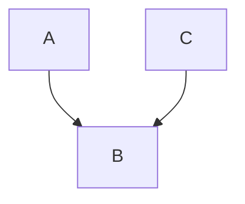

# 并查集

### 引入

想象你是一个班主任，你有一群学生，他们分成好多个**小团体**，给你任意两个人，你要告诉我这两个人是不是属于同一个小团体的？他们两个人的头目分别是谁？

接下来我们给出一个细致一点的问题：

班里的团体有两个规则：

1. 如果A和B是朋友， 那么他们在一个团体里。
2. 如果B和C是朋友，那么A、B、C在同一个团体里，也就是说，朋友的朋友也是朋友！

你每天会收到一些小纸条，上面写着`A和B是朋友`，你需要做的事有两个：

1. 合并： 根据纸条上的内容，把本来独立的团体合并成更大的团体。
2. 查询： 如果有人问你，`X和Y是一个团体里的么？` 你需要快速的告诉他们`是`或`不是`。

### 讲解

***并查集***（Disjoint Set Union, DSU）就是专门解决这种问题的， 他的名字里就说明了其所能完成的两个操作 （合并， 查询）。

1. 并（Union） ： 合并两个集合
2. 查（Find） ： 查询某个元素属于哪个集合。

那么我们怎么使用代码来实现这个东西呢？

在实现 `Find` 和 `Unite` 函数之前，我们要先准备一个数组，用于存储头目，比如， `i` 的头目，我们就把它存到`parent[i]`中。

这样我们就有初始化操作， 因为一开始并没有说谁是谁的朋友， 于是每个人的头目都是他们自己 :

```cpp
for(int i = 0; i < n; i ++)
    parent[i] = i;
```

然后我们要实现查找操作对吧，即`Find`函数。

这个函数的作用，就是返回我们查询的人的头目，也就是返回`parent[i]`！

对么？ 好像不是特别对。

因为我们提到， 如果 A 、 B 、 C都是朋友， 那么他们三个人的头目应该只能有一个对吧，我们不管谁是头目，但是返回值应该是同一个人！

所以我们要一直找，知道存在一个人的 `parent[x] == x`,即头目是自己，说明我们们找到了 `i` 的头目是 `x`,对吧。


不论是上面这种，还是下面这种，总之 ABC 三个人只能有一个头目对吧。



因此我们可以用递归，来写出这个`find`函数！

```cpp
int find(int i) {
	if(parent[i] == i)
        return i;
    else
        return find(parent[i]);
}
```

但是其实这部分可以加速，不知道你有没有发现。

好比我们第一次调查A的头目的时候，历尽千辛万苦，发现A的头目先是B，B的头目又是C，最终才确定， A的头目是C！

这个过程之后，我们正常的`find`就结束了对吧，但是其实我们可以聪明一点！

在查找的过程中，让A的头目在能找到下家的时候往上指，即我们找到了A的头目是C，那么我们就从现在起，让A的头目变成C，这样以后再查的话，就不会重新问一遍B了！

可以写成这样！这个做法就叫做 **路径压缩**

```cpp
int find(int i) {
	if(parent[i] == i)
        return i;
    else
        return parent[i] = find(parent[i]); //关键的一步！更新了parent[i]
}
```


那么`find`结束了，我们就需要有`Unite`函数了，即合并两个人的头目。

我们知道了A和B是属于同一个阵营的， 现在又来了个C！

他说我和A是同一阵营的！那么我们要把C和A合并！

我们就要先知道A的老大是谁吧，我们还需要知道C的老大是谁，然后让C的老大变成A的老大，这样他们两个就是同一个阵营得了吧！

所以我们可以写出 `unite`函数了！

```cpp
void unite(int i, int j) {
    int fa_i = find(i); //找到i的老大！
    int fa_j = find(j); //找到j的老大！
    if(fa_i != fa_j) //如果他们两个不是一个老大的兵！
        parent[fa_j] = fa_i; //两个老大不能同时都当老大对吧，就必须委屈其中一个，变成新老大的小弟了！
}
```


诶！综上，你就学会了并查集咯~

就到这里，明天见~ **awa**

​	---- by Nil

